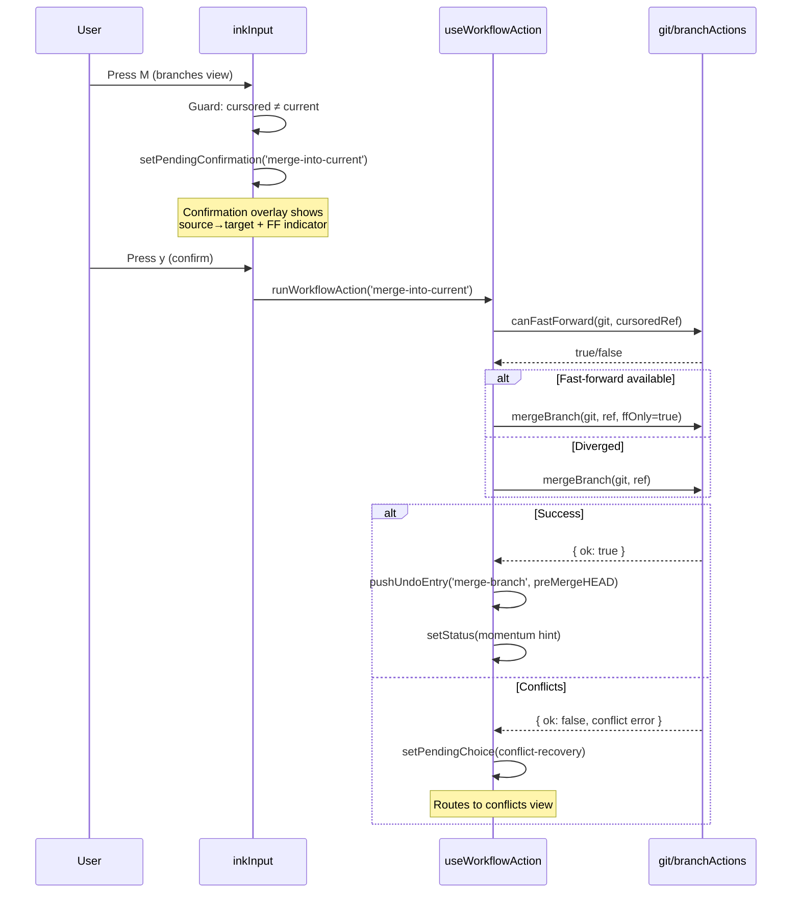
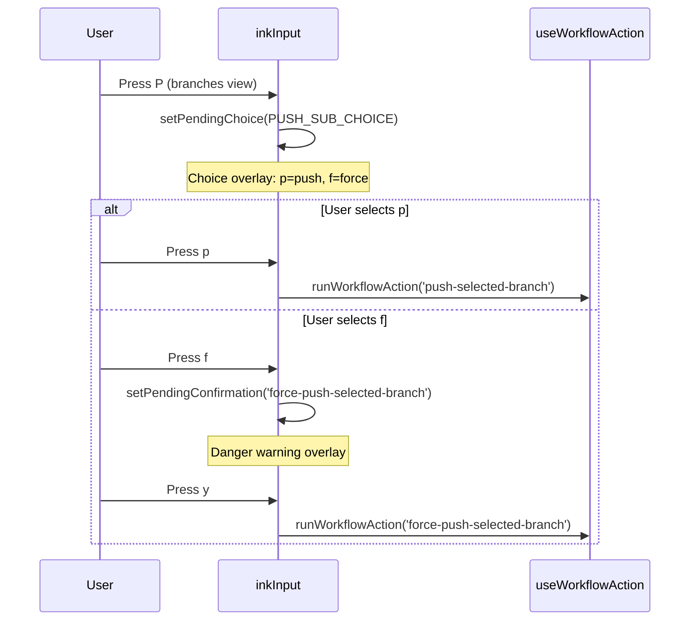

# Design Document: Workstation Branch Operations

## Overview

This feature adds five new branch-level workflows to the coco workstation branches view (`g b`): merge, reset-to-ref, force-push (via sub-choice from existing `P`), pull-with-strategy-choice (enhancement to existing `U`), and sync (pull+push compound). These extend the existing patterns — `useWorkflowAction` handlers, `pendingChoice` overlays, the `undoStack`, and `postApplyHints`-style momentum hints — without introducing new architectural concepts.

The design mirrors what's already in place for the history view's `Z` reset, the PR triage view's `m` merge-strategy picker, and the push-rejected → force-push escalation flow. Each new operation follows the same keypress → choice/confirmation → git action → status + momentum hint pipeline that every existing write operation uses.

---

## Architecture

The feature integrates across four layers (matching the existing `lib ← git ← workstation ← commands` direction):

```
┌──────────────────────────────────────────────────────────┐
│ inkInput.ts (branch-action predicate)                    │
│   M → merge choice/confirm                              │
│   Z → reset mode choice → confirm                       │
│   P → push sub-choice (normal / force)                  │
│   S → sync (no confirm — non-destructive)              │
│   U → pull (enhanced with divergence recovery)          │
├──────────────────────────────────────────────────────────┤
│ inkWorkflows.ts (workflow registrations)                  │
│   merge-into-current, reset-to-branch, sync-branch,    │
│   (existing: force-push-current-branch,                 │
│    pull-rebase-current, pull-merge-current)              │
├──────────────────────────────────────────────────────────┤
│ useWorkflowAction.ts (handlers)                          │
│   merge handler → git merge + conflict routing          │
│   reset-to-branch handler → git reset + undo entry      │
│   sync handler → pull-then-push compound                 │
├──────────────────────────────────────────────────────────┤
│ src/git/branchActions.ts (new git functions)             │
│   mergeBranch(), resetCurrentBranchToRef(),             │
│   canFastForward(), syncBranch()                        │
└──────────────────────────────────────────────────────────┘
```

---

## Components and Interfaces

### New Git Layer Functions (`src/git/branchActions.ts`)

```typescript
/** Merge the named branch into the current branch. */
export function mergeBranch(
  git: SimpleGit,
  branchName: string,
  fastForwardOnly?: boolean
): Promise<BranchActionResult>

/** Detect if the current branch can fast-forward to the given ref. */
export function canFastForward(
  git: SimpleGit,
  targetRef: string
): Promise<boolean>

/** Reset the current branch to a given ref with the specified mode. */
export function resetCurrentBranchToRef(
  git: SimpleGit,
  targetRef: string,
  mode: ResetMode
): Promise<BranchActionResult>

/**
 * Determine if a reset to targetRef would move the branch pointer
 * backward (history rewrite) vs forward. Returns true when targetRef
 * is an ancestor of HEAD — meaning HEAD has commits beyond targetRef
 * that the reset would discard.
 */
export function isResetBackward(
  git: SimpleGit,
  targetRef: string
): Promise<boolean>
```

### New Workflow IDs

| Workflow ID | Key | Context | Confirmation | Description |
|-------------|-----|---------|--------------|-------------|
| `merge-into-current` | `M` | branches | y-confirm | Merge cursored branch into current |
| `reset-to-branch` | `Z` | branches | y-confirm | Reset current branch to cursored ref |
| `sync-branch` | `S` | branches | none | Pull + push compound |

### Enhanced Existing Workflows

| Workflow ID | Change |
|-------------|--------|
| `push-selected-branch` | `P` now raises a sub-choice: normal push / force push (instead of immediately pushing) |
| `pull-selected-branch` / `pull-current-branch` | Already handles divergence via `isDivergedPullError` — no change needed beyond registering in the sync compound |

### New Choice Prompts (`inkInput.ts` constants)

```typescript
// Note: The merge flow uses `setPendingConfirmation('merge-into-current')` directly.
// The dynamic confirmation text (branch names + FF indicator) is computed in the
// workflow registration's `warning` callback, not as a separate choice constant.
// See the workflow registration in the Command Palette Integration section.

const RESET_TO_BRANCH_MODE_CHOICE = {
  id: 'reset-to-branch-mode-choice',
  title: 'Reset current branch to the cursored branch',
  warning: 'hard discards ALL uncommitted working-tree changes.',
  options: [
    { key: 's', label: 'Soft — keep changes staged', workflowId: 'reset-to-branch', payload: 'soft' },
    { key: 'm', label: 'Mixed — keep changes unstaged', workflowId: 'reset-to-branch', payload: 'mixed' },
    { key: 'h', label: 'Hard — discard working-tree changes', workflowId: 'reset-to-branch', payload: 'hard', destructive: true },
  ],
}

const PUSH_SUB_CHOICE = {
  id: 'push-sub-choice',
  title: 'Push branch',
  options: [
    { key: 'p', label: 'Push (normal)', workflowId: 'push-selected-branch' },
    { key: 'f', label: 'Force push (--force-with-lease)', workflowId: 'force-push-selected-branch', destructive: true },
  ],
}
```

### Keybinding Assignments (Branches View)

Current branches view keys: `Enter`, `+`, `R`, `D`, `u`, `F`, `U`, `P`, `r`, `s`, `m`.

New assignments:
- **`M`** — merge (uppercase; distinct from existing `m` mark-compare-base)
- **`Z`** — reset-to-ref (matches history view's `Z` convention)
- **`S`** — sync (uppercase; distinct from existing `s` cycle-sort)
- **`P`** — enhanced: raises push sub-choice (normal / force) instead of immediately pushing

No new top-level binding needed for force-push — it lives as a sub-option of `P` and as a momentum-hint escalation after a rejected normal push (existing pattern). Pull-with-strategy remains on `U` with the existing diverged-pull recovery.

**Collision check:** `M`, `Z`, `S` are all free in the branches view context. `P` already exists and is being enhanced (not added). The `inkKeymap.collisions.test.ts` guard will validate this.

---

## Data Models

### New Undo Entry Variants

The existing `UndoEntry` union in `undoStack.ts` needs two new variants:

```typescript
export type UndoEntry =
  | { kind: 'delete-branch'; ... }
  | { kind: 'drop-stash'; ... }
  | { kind: 'reset-to-commit'; ... }
  | { kind: 'delete-tag'; ... }
  // NEW:
  | { kind: 'merge-branch'; label: string; depth: number; workdir?: string; previousSha: string }
  | { kind: 'reset-to-branch'; label: string; depth: number; workdir?: string; previousSha: string; mode: ResetMode }
```

The `merge-branch` undo performs `git reset --hard <previousSha>` (since a merge creates a new commit, undoing it means resetting to the pre-merge HEAD). The `reset-to-branch` undo performs `git reset --<originalMode> <previousSha>` (same pattern as the existing `reset-to-commit` entry).

Note: The existing `reset-to-commit` entry type already handles the undo for history-view resets. The new `reset-to-branch` entry is structurally identical but uses a distinct `kind` so undo messages can reference the branch name context.

### State Additions (`LogInkState`)

No new state fields required. The feature uses existing state mechanisms:
- `pendingChoice` — for mode/strategy pickers
- `pendingConfirmationId` — for y-confirm overlays
- `status` / `statusKind` — for success/error/loading messages
- `undoStack` — for recording reversible operations
- `activeView` — for conflict routing (set to `'conflicts'`)

### Workflow Context (`LogInkWorkflowContext`)

Already carries `branches?: BranchOverview` which includes `currentBranch`, the full branch list, and upstream info. No additions needed.

---

## Error Handling

### Merge Errors

| Condition | Handling |
|-----------|----------|
| Cursored branch = current branch | Prevent initiation. Status: "Cannot merge a branch into itself." |
| Working tree dirty (git refuses) | Status error with git's message |
| Conflicts detected | Route to conflicts view via existing `isOperationConflictError` + `setPendingChoice` pattern |
| Merge already in progress | Status error: "A merge is already in progress. Use `g x` to resolve or abort." |

### Reset Errors

| Condition | Handling |
|-----------|----------|
| Cursored branch = current branch | Prevent initiation. Status: "Nothing to reset — branch is already at that ref." |
| Working tree dirty + hard mode | Git refuses; surface the error. (The confirmation already warns.) |

### Push/Force-Push Errors

| Condition | Handling |
|-----------|----------|
| `--force-with-lease` rejected (remote has unseen commits) | Status error: "Remote has commits you haven't fetched. Run F to fetch first." |
| No upstream configured | Status error: "No upstream — set one with `u` first." |
| Danger warning fails to display | Block execution entirely. The confirmation panel rendering is a prerequisite — if `pendingConfirmationId` is set but the overlay isn't visible (a bug), the `y` keypress handler must not fire the workflow. (Enforcement: the overlay render returns a boolean indicating it rendered; the input handler checks this.) |

### Sync Errors

| Condition | Handling |
|-----------|----------|
| No upstream configured | Prevent initiation. Status: "No upstream — press `u` to set one first." |
| Pull phase diverges | Present strategy-choice (rebase/merge) — same as standalone pull |
| Pull phase conflicts | Route to conflicts view, status: "Sync interrupted — resolve conflicts then push manually with P." |
| Push phase fails (non-fast-forward) | Status error with failure reason; pull result is preserved (already committed) |

---

## Fast-Forward Detection

Before showing the merge confirmation overlay, the handler calls `canFastForward(git, cursoredBranchRef)`:

```typescript
async function canFastForward(git: SimpleGit, targetRef: string): Promise<boolean> {
  // Current HEAD is an ancestor of targetRef AND targetRef is NOT
  // an ancestor of current HEAD (i.e., target is strictly ahead).
  try {
    const mergeBase = (await git.raw(['merge-base', 'HEAD', targetRef])).trim()
    const currentHead = (await git.raw(['rev-parse', 'HEAD'])).trim()
    return mergeBase === currentHead
  } catch {
    return false
  }
}
```

When fast-forward is available:
- The confirmation overlay text says "Fast-forward merge — no merge commit will be created"
- The merge handler uses `git merge --ff-only` 
- The success momentum hint says "Fast-forwarded `<current>` to `<target>`. Push with P"

When branches have diverged:
- The confirmation overlay says "Merge `<source>` into `<target>` — creates a merge commit"
- Standard `git merge <branch>` is used

---

## Confirmation Flow

All confirmations use the existing `y-confirm` overlay system (`pendingConfirmationId` + `LogInkWorkflowAction.requiresConfirmation: true`). The specific flows:

### Merge (`M`)

1. User presses `M` on cursored branch
2. Guard: if cursored = current → status error, return (prevents initiation)
3. Async: compute `canFastForward` result
4. Show confirmation overlay with branch names + FF indicator
5. On `y` → execute merge → on success: momentum hint + undo entry; on conflict: route to conflicts view

### Reset (`Z`)

1. User presses `Z` on cursored branch
2. Guard: if cursored = current → status error, return (prevents initiation)
3. Show mode-choice prompt (s/m/h) — same pattern as history view's `Z`
4. User selects mode → confirmation overlay with history-rewrite warning (extra warning for hard mode)
5. On `y` → execute reset → record undo entry → momentum hint (force-push suggestion only if `isResetBackward` returns true and branch has upstream)

### Push (`P` enhanced)

1. User presses `P` on cursored branch (or current branch)
2. Show push sub-choice: `p` normal / `f` force-push
3. If `p` → existing `push-selected-branch` workflow (no extra confirm)
4. If `f` → `force-push-selected-branch` workflow (requires y-confirm with danger warning)
5. Force-push confirmation MUST display the danger warning. If the warning fails to render, execution is blocked.

### Sync (`S`)

1. User presses `S` (no confirmation — compound of two non-destructive ops)
2. Guard: no upstream → status error suggesting `u`
3. Execute pull (ff-only) → if diverged, present strategy choice → on conflict, abort sync + route to conflicts
4. If pull succeeded → execute push → on success: "Branch fully synchronized. View history with gh"

---

## Undo Entries

### Merge Undo

```typescript
// Recorded on merge success:
{ kind: 'merge-branch', label: `merge ${source} into ${target}`, depth, workdir, previousSha: premergeHead }

// Reversed via:
git.raw(['reset', '--hard', previousSha])
```

This matches the existing `reset-to-commit` inverse pattern. A merge undo always uses `--hard` because the merge commit itself is what's being unwound — there's no meaningful "keep staged" state for a merge reversal. Note: if the user had unrelated uncommitted changes that survived the merge (rare — git usually refuses merges with a dirty tree), the hard-reset undo would discard those changes too. The undo's `g u` feedback message should mention this: "Undid merge (hard reset) — uncommitted changes were not preserved."

### Reset-to-Branch Undo

```typescript
// Recorded on reset success:
{ kind: 'reset-to-branch', label: `reset to ${target} (${mode})`, depth, workdir, previousSha, mode }

// Reversed via (same as reset-to-commit):
restorePreviousHead(git, previousSha, mode)
```

Uses the same `restorePreviousHead` function the existing `reset-to-commit` undo calls.

---

## Conflict Routing

When a merge or pull-with-strategy produces conflicts, the workstation routes to the conflicts view using the existing `isOperationConflictError` detection + `setPendingChoice` pattern already used by `rebase-onto-branch`, `cherry-pick-commit`, `pull-current-branch`, etc.

The existing code in `useWorkflowAction.ts` already has a `conflictRecoveryTitles` map. The new workflow IDs are added to it:

```typescript
const conflictRecoveryTitles: Record<string, string> = {
  ...existing,
  'merge-into-current': 'Merge stopped on conflicts',
}
```

The sync workflow handles conflicts specially: when the pull phase hits conflicts, the sync aborts (doesn't attempt push) and routes to the conflicts view with a message that the sync was interrupted.

---

## Key Registration

### `inkKeymap.ts` — `LOG_INK_KEY_BINDINGS` additions

```typescript
{ keys: ['M'], contexts: ['branches'], label: 'merge', id: 'merge-into-current' },
{ keys: ['Z'], contexts: ['branches'], label: 'reset', id: 'reset-to-branch' },
{ keys: ['S'], contexts: ['branches'], label: 'sync', id: 'sync-branch' },
```

`P` already exists for branches (push); its behavior changes from direct-fire to sub-choice, but the binding entry stays the same.

### `inkInput.ts` — branch action predicate handler

The new keys are handled inside the existing `if (isBranchActionTarget(state) && context.branchCount)` block. Note: `isBranchActionTarget` returns true for BOTH the branches view proper (`activeView === 'branches' && focus === 'commits'`) AND the sidebar when `sidebarTab === 'branches'`. The new handlers inherit this dual-scope automatically — no extra handling needed, but be aware that the cursored branch may come from either context.

```typescript
if (inputValue === 'M') {
  // Guard: can't merge into self
  if (cursoredBranch === currentBranch) {
    return [action({ type: 'setStatus', value: "Cannot merge a branch into itself.", kind: 'error' })]
  }
  return [action({ type: 'setPendingConfirmation', value: 'merge-into-current' })]
}

if (inputValue === 'Z') {
  // Guard: can't reset to self
  if (cursoredBranch === currentBranch) {
    return [action({ type: 'setStatus', value: "Nothing to reset — already at that ref.", kind: 'error' })]
  }
  return [action({ type: 'setPendingChoice', value: RESET_TO_BRANCH_MODE_CHOICE })]
}

if (inputValue === 'S') {
  return [{ type: 'runWorkflowAction', id: 'sync-branch' }]
}

// Enhanced P — sub-choice instead of direct push
if (inputValue === 'P') {
  return [action({ type: 'setPendingChoice', value: PUSH_SUB_CHOICE })]
}
```

---

## Command Palette Integration

New workflow registrations in `inkWorkflows.ts` → `getLogInkWorkflowActions()`:

```typescript
{
  id: 'merge-into-current',
  key: 'M',
  label: 'Merge branch into current',
  description: 'Merge the selected branch into the current branch',
  kind: 'destructive',
  requiresConfirmation: true,
  warning: (state) => `Merging into ${currentBranch}. Creates a merge commit (or fast-forwards if possible).`,
},
{
  id: 'reset-to-branch',
  key: '',  // Empty — routed via mode-choice, not direct key in palette
  label: 'Reset current branch to ref',
  description: 'Move the current branch pointer to match the selected ref',
  kind: 'destructive',
  requiresConfirmation: true,
  warning: 'Rewrites local history. Use g u to undo if needed.',
},
{
  id: 'sync-branch',
  key: 'S',
  label: 'Sync branch (pull + push)',
  description: 'Pull from remote then push local commits',
  kind: 'normal',
  requiresConfirmation: false,
},
```

The existing `force-push-current-branch` and `force-push-selected-branch` registrations already exist in the workflow table. They're accessed through the push sub-choice and through the non-fast-forward escalation path.

---

## Footer Hints

New hints added to the branches view footer band (space-permitting, per narrow-terminal trimming rules):

```
M merge  Z reset  S sync  P push  ...existing...
```

Priority ordering (highest → lowest, leftmost survives trimming):
1. `Enter` checkout (most common)
2. `M` merge (new, high-value)
3. `P` push (enhanced)
4. `S` sync (new, compound convenience)
5. `Z` reset (new, destructive)
6. `+` create, `R` rename, `D` delete, `u` upstream (existing)

---

## Momentum Hints

Following the `postApplyHints.ts` pattern, each successful operation returns a hint naming the next keystroke:

| Operation | Momentum Hint |
|-----------|---------------|
| Merge (FF) | `"Fast-forwarded {current} to {source}. Push with P"` |
| Merge (commit) | `"Merged {source} into {current}. Push with P"` |
| Reset (backward + has upstream) | `"Reset {current} to {target} ({mode}). Force-push with P → f"` |
| Reset (forward or no upstream) | `"Reset {current} to {target} ({mode}). View history with gh"` |
| Sync | `"Branch fully synchronized. View history with gh"` |
| Force-push | `"Force-pushed {branch} (with lease). View history with gh"` |

---

## Testing Strategy

### Unit Tests

- **Git layer** (`branchActions.test.ts`): `mergeBranch`, `canFastForward`, `resetCurrentBranchToRef`, `isResetBackward` against mock `SimpleGit` instances
- **Undo stack** (`undoStack.test.ts`): new `merge-branch` and `reset-to-branch` entry push/pop/perform
- **Choice constants**: verify `RESET_TO_BRANCH_MODE_CHOICE` and `PUSH_SUB_CHOICE` option shapes
- **Workflow registrations**: confirm collision-test passes with new bindings

### Integration Tests

- Scenario-based tests using `@gfargo/git-scenarios`:
  - `mid-merge-conflict` — verify conflict routing
  - Feature branch ahead/behind scenarios — verify FF detection
  - Diverged branch — verify pull strategy choice triggers

### Property-Based Testing Assessment

PBT is **not appropriate** for this feature. The operations are:
- Git wrapper functions (external service calls)
- UI workflow orchestration (input → state transitions)
- Side-effect-heavy (write to git, read state, route views)

The behavior doesn't vary meaningfully with random input — it's driven by discrete git states (ahead/behind/diverged/conflicted) and discrete user choices (key presses). Example-based unit tests against mocked `SimpleGit` and scenario-based integration tests provide the right coverage.

---

## Mermaid: Merge Flow



## Mermaid: Push Sub-Choice Flow


